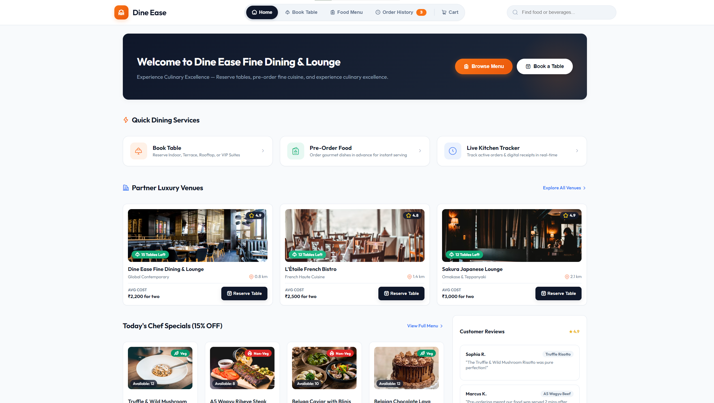

# 🍽️ Dine Ease — Luxury Restaurant Table Reservation & Food Pre-Ordering Platform



**Dine Ease** is a state-of-the-art, single-page web application (SPA) built for modern restaurant table reservations, live venue capacity management, interactive digital dining menus, and multi-mode payment checkouts. Designed with **AngularJS 1.8**, **Vanilla CSS3 Design System**, and **Hugeicons Stroke Iconography**, Dine Ease provides a seamless end-to-end dining experience from venue discovery to digital receipt generation.

---

## 🌟 Key Features

### 🪑 1. Real-Time Table Reservation & Capacity System
- **Dynamic Table Allocation**: Automatically calculates required tables based on guest party size ($1\text{–}4\text{ guests} = 1\text{ table}$, $5\text{–}8\text{ guests} = 2\text{ tables}$, etc.).
- **Live Occupancy Tracking**: Real-time tracking of venue table availability with safety guards preventing bookings beyond total venue capacity.
- **Session-Safe Allocation**: Intelligent table allocation rollback prevents table leaks during form updates or session refreshes.
- **Baseline Floor Limits**: Enforces starting baseline occupancy limits (`initialReservedCount`) so system-booked tables cannot be decremented below baseline.
- **Venue Filters & Search**: Filter restaurants by cuisine type (*Global Contemporary*, *French Haute Cuisine*, *Omakase & Teppanyaki*, *Modern Indian*, *Authentic Italian*, *Prime Steaks*).

### 🍕 2. Interactive Pre-Order Food Menu
- **Categorized Menu Browsing**: Explore Starters, Main Courses, Chef Specials, Artisanal Desserts, and Premium Wine Pairings.
- **Dietary Badges**: Clear `Veg` (Green) and `Non-Veg` (Red) indicators with prep time estimates ($15\text{–}45\text{ mins}$).
- **Smart Search**: Instant live keyword filtering across dishes, ingredients, and restaurant venues.
- **Quantity & Price Computation**: Instant subtotal calculation with live cart updates.

### 💳 3. Multi-Channel Payment Gateway
- **4 Payment Methods**:
  - 💳 **Credit & Debit Cards** (VISA, MasterCard, AMEX, RuPay)
  - 📱 **UPI Apps & QR Code** (Google Pay, PhonePe, Paytm, BHIM) with live dynamic QR generation
  - 🏛️ **NetBanking** (HDFC, ICICI, SBI, Axis, Kotak, 50+ Banks)
  - 💵 **Pay at Counter / POS** (Cash & Card terminal on arrival)
- **Promo Code Engine**: Supports promotional discount codes (e.g. `DINEEASE15` for 15% OFF).
- **Line-by-Line Price Breakdown**: Clear division of Items Subtotal, GST & Govt Taxes (5%), Table Booking Fees, and Promo Discounts.

### 📜 4. Order History & Re-Order Preferences System
- **Live Kitchen Tickets & History**: Filter orders by status (*Active Kitchen Orders* vs *Delivered & Served*).
- **Line-by-Line Price Division**: Itemized digital receipt showing Subtotal, 5% GST, Table Fees, Promo Discounts, and Payment Method.
- **Dual-Mode Re-Order Preference**:
  - 🛒 **Food Items Only**: Adds dishes to cart for standalone takeaway/pre-order and opens Food Menu.
  - 🍽️ **Food + Table Reservation**: Resolves venue availability, populates cart, and navigates directly to Table Reservation form.
- **Zero-Reflow Radio Selection**: Smooth, zero-flicker option toggling with equal 50/50 CTA button layouts.

---

## 🎨 Design System & Architecture

- **Color Palette**: Curated dark slate primary palette (`#0f172a`), emerald accents (`#059669`), vibrant orange highlights (`#f97316`), and soft background fills (`#f8fafc`).
- **Typography**: Google Font **Outfit** (`300`, `400`, `500`, `600`, `700`, `800`) for high-legibility typography.
- **Iconography**: Hugeicons Stroke Webfont library (`hgi-stroke`).
- **Mathematical Layout Grid**: 3-Column Grid Navbar (`grid-template-columns: 1fr auto 1fr`) ensuring 100% mathematical centering of the floating navigation pill across all screen resolutions.

---

## 🛠️ Technology Stack

| Component | Technology |
| :--- | :--- |
| **Frontend Framework** | AngularJS 1.8 (MVC Pattern) |
| **Styling & Design System** | Vanilla CSS3 (CSS Variables, Flexbox, Grid, Keyframe Animations) |
| **Markup** | Semantic HTML5 with WAI-ARIA Accessibility |
| **Iconography** | Hugeicons Stroke Webfont |
| **HTTP Dev Server** | Node.js `http-server` / Live Server |

---

## 📐 AngularJS Technical Information & Directives Used

This project follows AngularJS 1.8 Model-View-Controller (MVC) architecture with `$scope` data binding, custom filters, and built-in directives:

### Core AngularJS Directives Employed:

| Directive | Purpose & Usage in Dine Ease |
| :--- | :--- |
| `ng-app="dineEaseApp"` | Initializes the root AngularJS application module. |
| `ng-controller="DineEaseController"` | Binds the main application controller managing state, venues, cart, reservations, and checkout workflows. |
| `ng-model` | Bi-directional data binding for form inputs (Customer Name, Mobile Phone, Guests, Date, Time, Occasion, Promo Code, Search Query). |
| `ng-click` | Event handler binding for view switching, cart manipulation, venue selection, table release/reserve, and payment confirmation. |
| `ng-submit` | Form submission handler for reservation and payment forms. |
| `ng-repeat` | Iterates over restaurant arrays, menu categories, cart items, payment tabs, and order history logs. |
| `ng-if` | Conditional DOM insertion/deletion for modal backdrops and capacity alert banners. |
| `ng-show` / `ng-hide` | Zero-reflow DOM visibility toggling for tab panels, step flows, and re-order button labels. |
| `ng-class` | Dynamic CSS class application (`active`, `is-selected`, `is-ready`, `is-disabled`, `is-full`). |
| `ng-disabled` | Enforces form validation constraints and locks booking CTA buttons when venue capacity is full. |
| `ng-pattern` | Regular expression validation for 10-digit mobile numbers (`/^[6-9]\d{9}$/`). |
| `ng-cloak` | Prevents FOUC (Flash of Unrendered Content) during AngularJS template initialization. |
| `currency` Filter | Formats currency values into Indian Rupees (`currency:'₹'`). |

---

## 🚀 Quick Start & Installation

### Prerequisites
- Node.js (v14+ recommended)
- Web browser (Chrome, Edge, Firefox, Safari)

### Local Setup Instructions

1. **Clone the Repository**:
   ```bash
   git clone https://github.com/YourUsername/Dine-Ease.git
   cd Dine-Ease
   ```

2. **Run Dev Server**:
   Using `npx http-server`:
   ```bash
   npx http-server -p 8080 -c-1
   ```
   Or using Python simple HTTP server:
   ```bash
   python -m http.server 8080
   ```

3. **Open in Browser**:
   Navigate to `http://localhost:8080` in your web browser.

---

## 📁 Repository Directory Structure

```
Dine-Ease/
├── index.html          # Main Single-Page Application Template & Views
├── css/
│   └── style.css       # Core Design System, CSS Tokens & Utility Layouts
├── js/
│   └── app.js          # AngularJS Application Module, Controllers & Dataset
└── README.md           # Project Documentation & Technical Overview
```

---

## 🔒 Form Validations & Booking Constraints

- **Phone Number Field**: 10-digit Indian mobile number format with prefilled `🇮🇳 +91` badge (`maxlength="10"`, pattern `/^[6-9]\d{9}$/`).
- **Table Capacity Model**: Calculates $\lceil \text{Guests} / 4 \rceil$ required tables. Prevents overbooking beyond `totalTables`.
- **Button Disable Pattern**: CTA buttons remain safely disabled until required fields pass validation and venue table capacity is available.

---

## 📝 License

Distributed under the **MIT License**. See `LICENSE` for details.

---

<p align="center">
  Crafted with ❤️ for Premium Dining Experiences by <strong>Dine Ease Team</strong>
</p>
